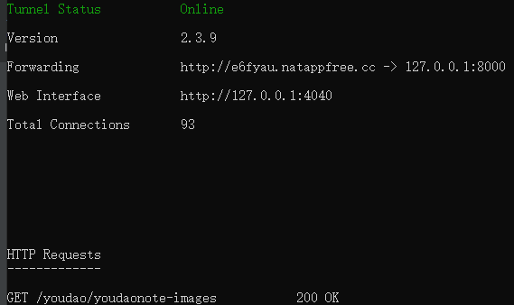
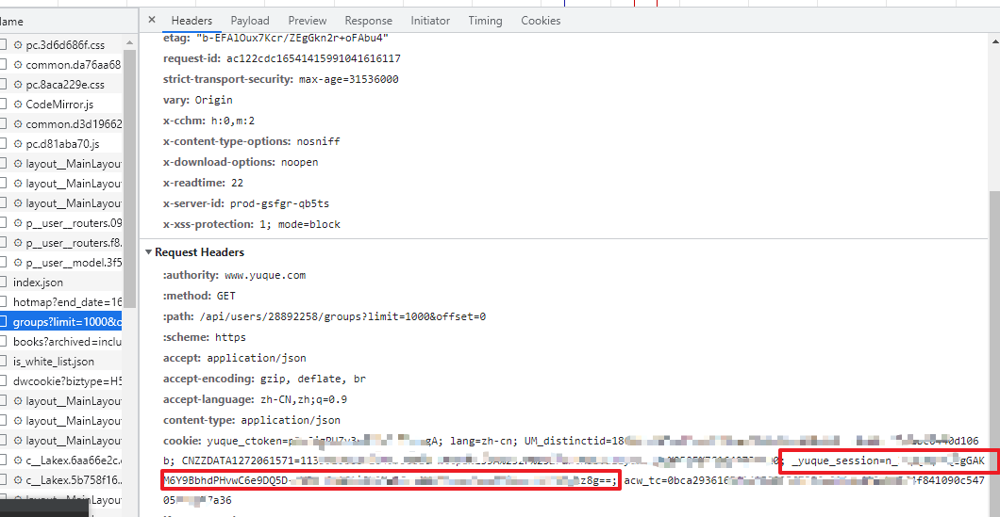

#背景
我用了几年的有道云笔记，一直被它的多端同步问题困扰，最近在百度上搜索一下云笔记同类产品，发现语雀的评价比较高，痛定思痛，毅然决定投到语雀的怀抱。

但怎么迁过去呢？我的有道云里有很多目录、很多笔记，手动迁吗？费时费力！后来找到这个脚本（项目地址：https://github.com/DeppWang/youdaonote-pull.git）
，它可以将云笔记全部按目录下载下来。

问题来了，得到本地的markdown文件，怎么按目录一键导进语雀呢？DeppWang大神没有交待，语雀的客户端也不支持……绝望……

于是，我决定自己动手，写了导入markdown至语雀的脚本。


#功能
- 有道云笔记根目录下的目录，会按各个知识库导入。如根目录有2个目录a和b，对应语雀的知识库a和知识库b；不喜欢的话，你可以事后在语雀里迁到你喜欢的知识库里
- 对于有道云笔记根目录下的markdown文档，会先在语雀里创建“未归档”这个知识库，并将这些markdown文档迁到这个知识库里，事后你可以将它们转移到你喜欢的知识库里
- 脚本无毒，不会收集用户的隐私数据，请放心使用

#使用步骤

1）搭建临时图床

youdaonote-pull脚本可以使用SM.MS图床，但如果你是免费账号或是没有SM.MS账号，下载的markdown里的图片链接就是本地链接，这在导进语雀后图片是无法显示的，所以需要搞个自己的图床。
如果你的SM.MS账号够用，可以省略此步骤。

实现思路是通过natapp做内网穿透，然后nginx做为代理，具体操作很简单，就详细说了。 natapp官网：https://natapp.cn/

我的nginx配置
```angular2html
#nginx.conf
 server {
        listen       8000;
        server_name  localhost;

        #charset koi8-r;

        #access_log  logs/host.access.log  main;

       
        location /youdao/ {
            root C:\Users\mayn\Desktop;
            sendfile on;
            gzip on; 
            gzip_comp_level 4;
            gzip_types image/*;
            gzip_http_version 1.1;
            access_log   off;
	 }
  }
```
我的natapp配的端口是8000，所以nginx这里也要配成8000；我的有道云目录是C:\Users\mayn\Desktop\youdao，nginx中root指定到C:\Users\mayn\Desktop就可以了

举个例子，我的natapp启动后，显示的是这个样子：


可以看到，通过 http://e6fyau.natappfree.cc这个域名可以访问到本地的8000端口，这样，当请求路径为http://e6fyau.natappfree.cc/youdao/youdaonote-images时，
nginx到将请求映射到C:\Users\mayn\Desktop\youdaonote-images目录，实现本地图片外网访问


2）拉取脚本
```angular2html
git clone https://github.com/lengmianshi/yueque-import.git
```

3）做好配置

需要在config.json是指定如下配置：

- dir：有道云笔记的目录，比如我的：C:\Users\mayn\Desktop\youdao\
- _yuque_session：语雀的cookie，获取方法：

- image_domain：通过多网访问图片的路径，比如我的http://acarh4.natappfree.cc/youdao/

4）启动脚本
```angular2html
python main.py
```

5）处理note文档

如果你的笔记带有表格，youdaonote-pull应该会将你的笔记保存为note文档，而不是markdown文档，note格式语雀是不认的，需要你手动处理。
查看笔记有哪些note文档：
```angular2html
python find_note_file.py
```


#捐赠
写脚本不易，期间经历了多番艰苦的调试。如果对你有所帮助，我将非常欣慰；如果你能支付宝捐助一二，我不胜感激！


